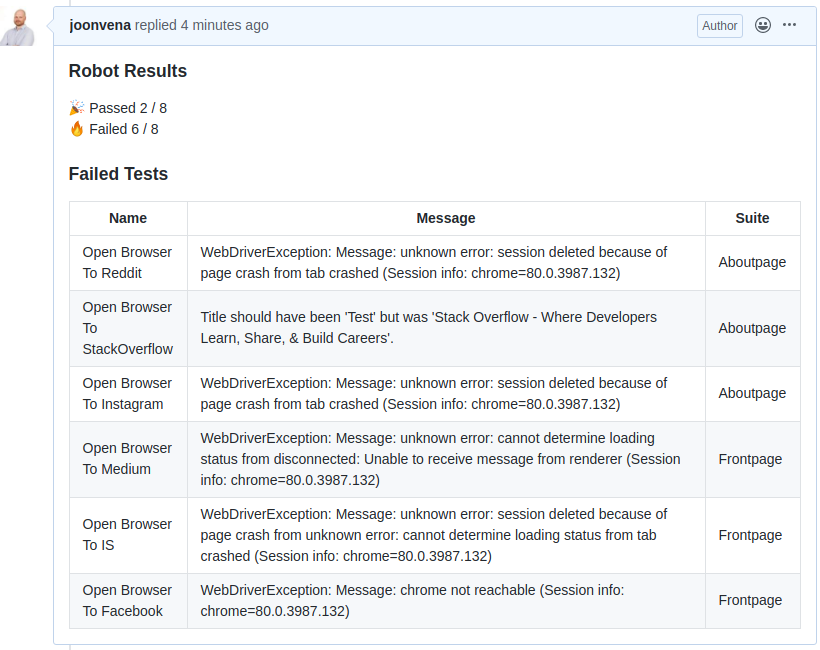

# Robot Framework Reporter Action

This action creates parsed report about the test run and sends it as comment to that specific commit that triggered the action.  

  

## Example usage


```jobs:
   generate_report:
        runs-on: ubuntu-latest
        steps:
        - uses: actions/checkout@v2
        - name: Download reports
          uses: actions/download-artifact@v1
          with:
            name: reports
        - name: Send report to commit
          uses: joonvena/robotframework-reporter-action@v1.1
          with:
            gh_access_token: ${{ secrets.GITHUB_TOKEN }}
```

## Example usage with [robotframework-docker-action](https://github.com/marketplace/actions/robot-framework)

```jobs:
    test:
        runs-on: ubuntu-latest
        steps:
        - uses: actions/checkout@v2
        - name: Execute tests
          uses: joonvena/robotframework-docker-action@v1.0
        - name: Upload test results
          uses: actions/upload-artifact@v1
          if: always()
          with:
            name: reports
            path: reports
    
    generate_report:
        if: always()
        needs: [test] 
        runs-on: ubuntu-latest
        steps:
        - uses: actions/checkout@v2
        - name: Download reports
          uses: actions/download-artifact@v1
          with:
            name: reports
        - name: Send report to commit
          uses: joonvena/robotframework-reporter-action@v1.1
          with:
            gh_access_token: ${{ secrets.GITHUB_TOKEN }}
```

Available settings:

| Name                     | Default            | Description                                                                                                   |
| ------------------------ | ------------------ | ------------------------------------------------------------------------------------------------------------- |
| gh_access_token          |                    | Token to access GH API. In most cases you can use GITHUB_TOKEN that is available in the workflow              |
| report_path              | 'reports'          | Path to reports from the download artifact action                                                             |
| sha                      | ${{ github.sha }}  | SHA of the commit that triggered the tests                                                                    |
